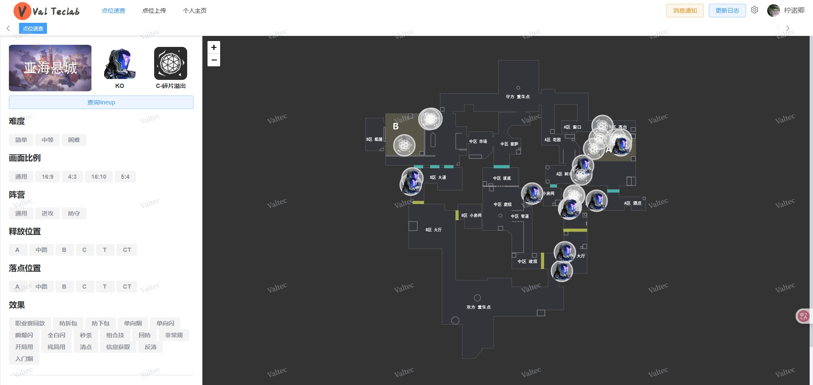

# 项目定位

ValPoint是一款点位规划工具，适用于无畏契约PC端、Valorant；数据在用户的手中，可以部署到本地，也可以使用云端部署。

# 项目由来

在2023年8月的时候，入坑了无畏契约，那时候什么都不懂，每个英雄都试玩过不少，最后选择了猎枭作为自己的主力英雄，因为是第一次玩FPS，所以打得畏畏缩缩，猎枭这种可以打信息枪的英雄，真的太适合我了。

猎枭大招狂猎之怒在开局时候，有概率让对面先掉点一个，同理，秒杀箭，也能让对面快速掉点，所以学会寻敌箭和秒杀箭就很关键了。

一开始是用语雀来记录我的点位图，不够直观，找一个点位都要划拉半天不方便，同样的笔记软件，比如obsidian、思源笔记，都存在着不够直观的痛点，每次找点位的时候，都特别麻烦。


直到最近一段时间，我在b站搜索点位网站时，发现了[valtec.fun](https://valtec.fun/#/lineupQuery)和[strats.gg](https://strats.gg/valorant/maps)等网站，~~（其实还有很多，但是都打不开了）~~，而且我发现了这两个网站的不足之处。

> valtec.fun：自己上传的点位图片，只能等作者审核才可以显示出来
>
> strats.gg：网站不能上传自己的点位，而且网站是国外的，访问比较慢




于是乎，valpoint结合这两个网站的痛点，应运而生。

# 项目功能


然后刚好又接触到了Gemini 3和GPT Team，其实在接触Gemini的canvas之前，我就已经接触了很多AI编程软件了，claude、codebuddy、trae等，它们给我的感觉都还是差点意思，甚至是figma make这种生成UI的也有所接触，可是生成的效果都不是很好，直到接触到了Gemini的canvas...

仅仅通过三次对话，生成的结果，就惊艳到我了...

```
https://valtec.fun/#/lineupQuery

我也想要创建一个这样的瓦罗兰特的点位网站，目前只有我自己一个人用，所以不需要多用户系统都可以，可以实现我自己上传点位，就可以了
```

第一次生成：

```
1、地图和特工，都要替换成中文名称
2、为什么没有显示平面图？
类似这种？不然我怎么进行标注呢？
```

```
你这个非常不直观，我希望是这种，左边选择地图、英雄、技能，然后可以选择放置角色、放置技能，右边就是一整块的地图，可以进行放大或者缩小，当我点击放置角色的时候，我可以在右边地图上随便放置角色头像（目前没有角色头像，可以随机使用emjio代替先，技能图片同理），再然后同样的逻辑，放置角色技能，然后保存之后，当我把鼠标移动到角色或者技能的图片上时，就会有两个之间的连线，右边的地图是使用https://leafletjs.com/进行绘制的
```

第二次生成：

于是，我就有了这个新的灵感，一点点的把我的需求投喂给Gemini，它的效率非常高，正向反馈非常棒，没有像之前的那种AI，生成时间多的时候，就开始发神经了，很难完成一个比较复杂的项目。

由于Gemini生成的是单文件的html，所以借助了codex帮忙落地，codex也是个很厉害的工具，正反馈也很强，不过也是在项目初期，现在到项目后期的情况，有时候也很棘手，需要对话很多次，才能处理得当。


毕竟我也只是懂一点点html+css而已，JavaScript都忘光了，更别说那些后端接口了。
# 项目定位

